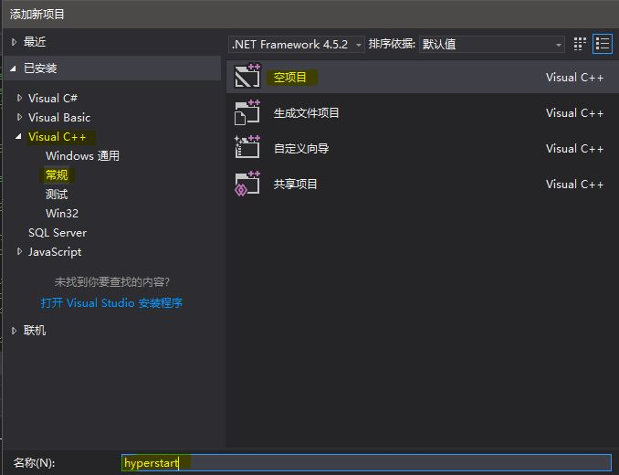
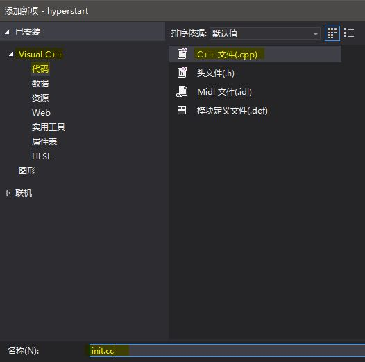
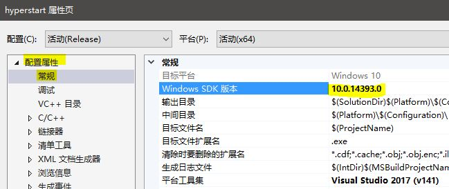
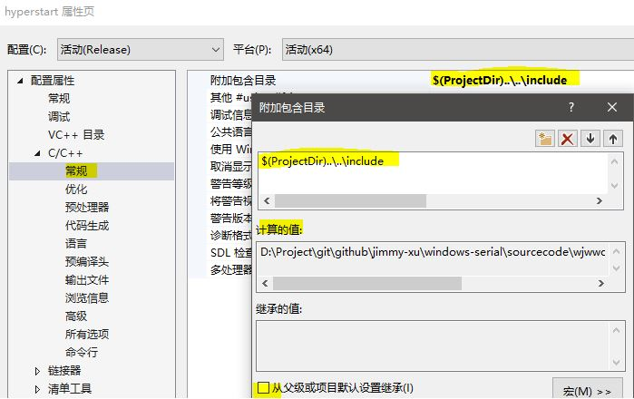
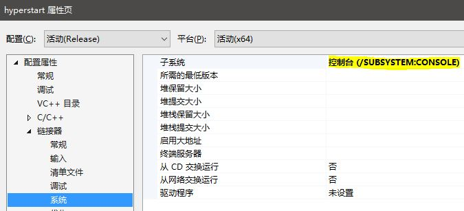
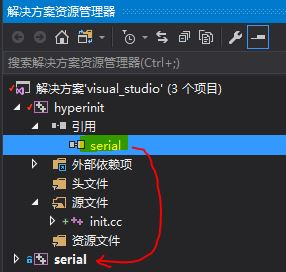
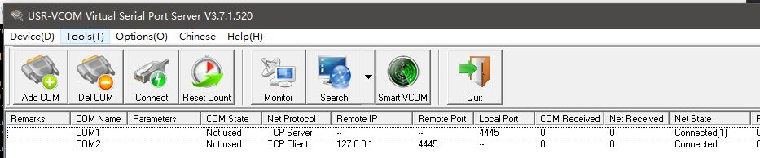

Create hyperstart project
=============================

# create hyperinit project



# create init.c



# config project

## winsdk config


## include dir config


## link subsystem config


## add reference



# build project

进入命令提示符，在hyperinit目录下
> build.bat

```
Microsoft (R) 生成引擎版本 15.1.548.43366
版权所有(C) Microsoft Corporation。保留所有权利。

生成启动时间为 2017/4/7 15:22:48。
节点 1 上的项目“D:\Project\git\github\jimmy-xu\windows-serial\sourcecode\wjwwood-serial\visual_studio\hyperstart\hyperstart.vcxproj”(默认目标)。
项目“D:\Project\git\github\jimmy-xu\windows-serial\sourcecode\wjwwood-serial\visual_studio\hyperstart\hyperstart.vcxproj”(1)正在节点 1 上生成“D:\Project\git\github\jimmy-xu\win
dows-serial\sourcecode\wjwwood-serial\visual_studio\serial\serial.vcxproj”(2) (默认目标)。
InitializeBuildStatus:
  正在创建“x64\Release\serial.tlog\unsuccessfulbuild”，因为已指定“AlwaysCreate”。
ClCompile:
  所有输出均为最新。
Lib:
  所有输出均为最新。
  serial.vcxproj -> D:\Project\git\github\jimmy-xu\windows-serial\sourcecode\wjwwood-serial\visual_studio\serial\x64\Release\serial.lib
FinalizeBuildStatus:
  正在删除文件“x64\Release\serial.tlog\unsuccessfulbuild”。
  正在对“x64\Release\serial.tlog\serial.lastbuildstate”执行 Touch 任务。
已完成生成项目“D:\Project\git\github\jimmy-xu\windows-serial\sourcecode\wjwwood-serial\visual_studio\serial\serial.vcxproj”(默认目标)的操作。

InitializeBuildStatus:
  正在创建“x64\Release\hyperstart.tlog\unsuccessfulbuild”，因为已指定“AlwaysCreate”。
ClCompile:
  所有输出均为最新。
Link:
  所有输出均为最新。
  hyperstart.vcxproj -> D:\Project\git\github\jimmy-xu\windows-serial\sourcecode\wjwwood-serial\visual_studio\hyperstart\x64\Release\hyperstart.exe
FinalizeBuildStatus:
  正在删除文件“x64\Release\hyperstart.tlog\unsuccessfulbuild”。
  正在对“x64\Release\hyperstart.tlog\hyperstart.lastbuildstate”执行 Touch 任务。
已完成生成项目“D:\Project\git\github\jimmy-xu\windows-serial\sourcecode\wjwwood-serial\visual_studio\hyperstart\hyperstart.vcxproj”(默认目标)的操作。


已成功生成。
    0 个警告
    0 个错误

已用时间 00:00:00.79
```

# execute init

## Virtual Serial Port

> create virtual serial port with USR-VCOM



## run hyperstart.exe
```
> run.bat
(COM1, ELTIMA Virtual Serial Port (COM1), EVSERIAL7)
(COM2, ELTIMA Virtual Serial Port (COM2), EVSERIAL7)
```
